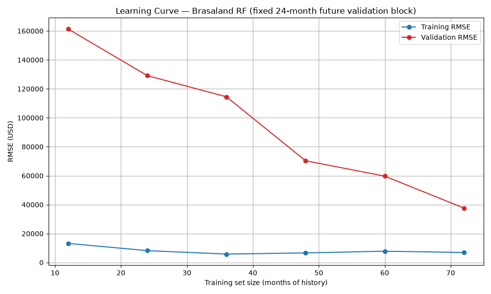

# Brasaland Sales Model — Technical Evaluation Report

Formal evaluation of the `RandomForestRegressor` sales forecaster (`src/app.py`),
requested by the tech-lead ticket before promoting the model to staging.
Generated with `uv run python src/evaluate_model.py` (metrics in
`data/eval/metrics.json`, learning curve in `data/eval/learning_curve.png`).

Reference: `content/contexts/sales-forecasting/brasaland/CONTEXT-brasaland.en.md`.

---

## 1. Business cost of errors & metric choice (from CONTEXT-brasaland)

The model feeds purchasing: **Felipe (Operations)** anticipates ingredient
purchases from the expected trend, and **Lucía (Procurement)** buys ahead of
**meat price fluctuations** based on projected volume. Brasaland is a
churrascaria, so its dominant input is **perishable meat**.

| Error type | Consequence |
|---|---|
| **Under-forecast** (pred < actual) | Stockouts in peak months, lost revenue, and reactive meat purchases at higher spot prices |
| **Over-forecast** (pred > actual) | Over-buying perishable meat → spoilage/waste and tied-up capital |

The most damaging errors are the **large single misses** (e.g. the December
holiday peaks): a big miss there is either a major stockout or a major
perishable overstock.

### Which direction is more costly? → **Over-estimation**
The CONTEXT/briefing don't state an explicit policy, so we reason from the
domain (perishable-inventory "newsvendor" logic):

- **Over-estimating sales** → over-order perishable meat → it **spoils**. This
  is an **unrecoverable full-cost loss** (we paid for meat we throw away) plus
  tied-up working capital. Cost ≈ the wasted meat's COGS.
- **Under-estimating sales** → under-order → **stockout** → we lose the
  **margin** on unserved covers (we never bought that meat, so no COGS was
  sunk), partially mitigable by substitution — a smaller per-unit loss than
  wasted premium meat.

Because wasted premium meat (full COGS) generally exceeds the lost margin of an
unserved cover, **over-estimation is the more costly error direction** for
Brasaland, and the forecast should lean slightly conservative.

> ⚠️ **Caveat that matters here:** our model's actual bias is the *opposite* —
> it systematically **under-forecasts**, especially the December peaks. Most
> months that under-bias is the "safer" (anti-spoilage) direction, but a
> December **stockout in the highest-revenue month** is a serious brand hit for
> a grill chain whose promise is a fast, consistent kitchen. So the model's
> single most business-relevant flaw is the peak under-forecast — reinforcing
> the corrective actions in §5.

**Primary metric: RMSE** — it penalizes large errors quadratically, so it
reflects Brasaland's real risk where a few big misses dominate. **MAE** is
reported alongside as the average USD miss (interpretability), but it is less
aligned with the "large errors hurt disproportionately" reality here. If the
business confirms the spoilage-vs-stockout asymmetry, an **asymmetric loss**
(penalizing over-prediction more) could be layered on top later.

---

## 2. Time-aware cross-validation (`TimeSeriesSplit`, 5 folds, no shuffle)

Cross-validation over the 96-month training window (2016-2023). Folds are
chronological (expanding window); no shuffling — each validation fold is
strictly later in time than its training portion.

| Metric | Validation (mean ± std) | Train (mean ± std) |
|---|---|---|
| **RMSE** | **33,688 ± 6,984 USD** | 7,678 ± 1,892 USD |
| **MAE** | **25,768 ± 6,477 USD** | 5,471 ± 1,262 USD |

Validation RMSE per fold: `[25,119, 42,634, 30,219, 29,167, 41,300]`.
Reference scale: mean monthly training revenue ≈ **605,468 USD** (so validation
RMSE ≈ 5.6% of the monthly mean; training RMSE ≈ 1.3%).

---

## 3. Learning curve

Chronological expanding-window curve: train on a growing prefix of history,
validate on a **fixed 24-month future block** (the last 2 training years).

| Train size (months) | 12 | 24 | 36 | 48 | 60 | 72 |
|---|---|---|---|---|---|---|
| Training RMSE (USD) | 13,206 | 8,216 | 5,829 | 6,636 | 7,822 | 6,936 |
| Validation RMSE (USD) | 161,313 | 129,135 | 114,503 | 70,303 | 59,688 | 37,653 |

**Pattern:** training error is consistently **low and flat** (~6–13k), while
validation error is **much higher but drops steeply** as more history is added
(161k → 38k). A **wide gap persists** between the two lines even at the largest
training size, but it is **shrinking** as data grows.

---

## 4. Metrics (train vs validation)

| Metric | Train (resubstitution) | Train (CV) | Validation (CV) |
|---|---|---|---|
| MAE  | 4,981 | 5,471 ± 1,262 | **25,768 ± 6,477** |
| RMSE | 7,268 | 7,678 ± 1,892 | **33,688 ± 6,984** |

---

## 5. Diagnosis: OVERFITTING (high variance)

The evidence points to **overfitting**, i.e. high variance:

- **Wide train↔validation gap.** Validation RMSE (33,688) is **~4.4×** the
  training RMSE (7,678); training error is only ~1.3% of the monthly mean while
  validation error is ~5.6%. Low training error + substantially higher
  validation error is the signature of a model that memorizes the training
  months rather than generalizing.
- **Learning curve confirms it.** The gap between the low, flat training curve
  and the high validation curve is large and persistent (not converging at a
  common low error → not well-fitted; training error is low, not high → not
  underfitting). The validation curve is still **declining** at 72 months,
  meaning the variance is data-limited.

This is **not underfitting** (training error is low, so the model captures the
in-sample pattern) and **not a good fit** (the validation gap is too wide).

### Root cause
The Random Forest uses scikit-learn defaults — `max_depth=None` and
`min_samples_leaf=1` — so its 100 unbounded trees can drive each leaf down to a
single month, memorizing training noise. That produces the near-zero training
error and the wide validation gap. The elevated validation level is compounded
by a **structural** issue: the strongest feature (`covers_served`) and the
target grow over time, and tree models cannot extrapolate beyond the training
range, so future months are systematically under-predicted (the same effect
that produced a high PSI and the December under-forecast on the real test set).

### Corrective action (specific, not generic)
1. **Regularize the Random Forest to cut variance (primary).** Increase
   `min_samples_leaf` (≈3–5) and cap `max_depth` (e.g. 6–10); optionally lower
   `max_features`. This directly attacks the memorization that creates the
   low-train / high-validation gap. Re-tune these via the same `TimeSeriesSplit`
   CV and confirm the gap narrows.
2. **Make the target extrapolable (structural).** Because trees can't
   extrapolate the growth trend, model a **detrended / relative** target — e.g.
   revenue-per-cover or year-over-year growth — or add an explicit trend
   feature / linear-trend + RF-residual hybrid. This targets the elevated
   validation floor and the December peak misses.

> Explicitly **not** the fix: "just add more data." We already use all 8 years
> of available history and cannot obtain more past months; the learning curve's
> continued decline reflects variance, which regularization + trend-aware
> features address directly.

---

## 6. Recommendation

**Do not promote as-is.** The model is overfitting. Apply regularization (1) and
re-evaluate with the same time-aware CV; if the December/trend miss persists,
add the trend-aware target/features (2) before promotion to staging.
