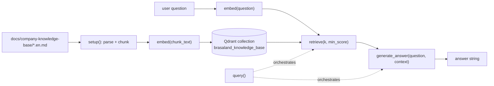

# Brasaland RAG Knowledge Base — Design (Milestone 7)

> Status: WIP scaffold. Flow, chunking and model choices are fixed below;
> concrete numbers (chunk counts, vector dim, tuned `min_score`, Recall@3) are
> filled in once the pipeline is implemented and run.

Reference: `content/contexts/07-trainning-rag/brasaland/CONTEXT-brasaland.en.md`
(mirrored corpus in `docs/company-knowledge-base/`).

## 1. RAG process (end-to-end flow)

Modules (one responsibility each, per the ticket):
- `data/process/rag.py` -> `setup()`, `embed()` (chunking + indexing).
- `data/pipelines/rag.py` -> `retrieve()`, `generate_answer()`, `query()`.
- `services/api/` -> FastAPI `POST /knowledge/query`.
- `uis/` -> minimal query UI.
- `tests/pipelines/test_rag.py` -> mocked unit tests for `retrieve()` + `query()`.

## 2. Chunking strategy

The four source documents are short, well-structured Markdown with clear
semantic units (a tier list, a numbered procedure, a per-dish allergen block).
We chunk **by semantic section**, not fixed character count, so no rule or
condition is cut in half:
- Split on Markdown headings and blank-line-separated blocks (tier list, FAQ
  block, numbered procedure, per-category list).
- Keep each list/procedure together as one chunk when small; otherwise group by
  subsection so a chunk is self-contained.
- Target >= 3 chunks per document (per CONTEXT section 5), each carrying its
  `section` title in the payload.

## 3. Payload / metadata (from CONTEXT section 3)

Each Qdrant point payload contains at minimum:
`company="brasaland"`, `source_document` (`loyalty-program | waste-protocol | menu-allergens | supplier-ordering`),
`section`, `language="en"`, `chunk_index`, and `text` (chunk body for prompt assembly).

Idempotency: deterministic point IDs (UUIDv5 of `source_document + chunk_index`)
so re-running `setup()` upserts in place instead of duplicating.

## 4. Embedding & generation practices

Two different models (never the same for both jobs):
- **Embeddings** (`embed()`): `sentence-transformers` `all-MiniLM-L6-v2`
  (384-dim, cosine distance) — local, no API key. Used identically at index
  time and query time.
- **Generation** (`generate_answer()`): a local instruction model
  (e.g. `google/flan-t5-base`) — answers from a salesperson's perspective using
  only retrieved context.

> Note: the milestone suggests the 4Geeks-provided hosted models. No 4Geeks
> credentials are available in this environment, so we default to local models.
> `embed()` and `generate_answer()` are isolated so swapping to the 4Geeks
> hosted embedding/generation endpoints is a one-function change each.

- **Distance metric:** cosine. **Vector dim:** 384 (MiniLM).
- **`min_score` threshold:** TBD (tuned against `data/eval/test-queries.json`);
  if no chunk clears it, `query()` states there isn't enough information — it
  never invents company facts.

## 5. Guardrails (CONTEXT section 4 & 6)

- Faithfulness: the answer must not contain numbers (%, amounts, kg) absent
  from the retrieved chunks.
- Allergens: never answer "zero risk"; follow `brasaland-menu-allergens.en.md`
  wording literally.
- Currency: keep COP/USD amounts exactly as written; no auto-conversion.
- Recall@3 target: >= 80% on the test queries.
